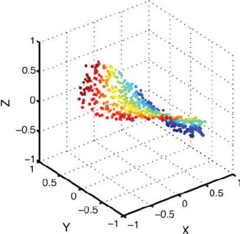

## Summary

### What and why

Embeddings represent members of a finite set (e.g. a vocabulary of words) as vectors. In essence, we want to take a discrete set of items and throw them into a geometric space. Presumably, imposing geometry means items can cluster together in groups based on some sort of similarity, such as semantic similarity with words. This helps us reduce the dimensionality of the problem: instead of one dimension for each item in the set (i.e. a million English words[^1]), we have a lower number for the embeddings (i.e. thousands for ChatGPT[^2]). In essence, we're saying that each item is made up of a smaller number of ingredients.

Why is a lower dimension useful? Each extra dimension loosely speaking adds an exponential amount of potential combinations of the data, also known as the [Curse of Dimensionality](https://en.wikipedia.org/wiki/Curse_of_dimensionality). This means that if we're trying to estimate some lower dimensional manifold in the space where the data sits (so that we can do things like prediction), we need exponentially more data to get a good statistical estimate of the manifold in any given region.

_A manifold of data in a higher dimensional space_

So I'd say dimensionality reduction is biggest reason behind embeddings. Models should simply perform better with them. But there are other reasons they are useful. They may be geometrically interpretable[^3]. They can also take different types of input (e.g. images, audio, text) and project them into a common space.

### How

Embeddings are found by simply one-hot encoding a discrete set of items, and using a linear first layer in the neural net. If a one-hot encoding in position $k$ is denoted as the basis vector $e_k$, and the first linear layer of the neural net has weight matrix $W$ of size (embedding dimensions, input dimensions), we see that

$$
W \cdot e_k
$$

simply pulls out column $k$ of the weight matrix. Thus in this form, column $k$ of $W$ is simply the embedding for that item. I have seen places where this is represented as

$$
e_k^T \cdot \tilde{W}
$$

In this case, the weight matrix $\tilde{W}$ would have dimensions (input dimensions, embedding dimensions), and in fact $e_k^T$ would be pulling out a _row_.

Training the "embeddings" then simply means training the whole neural network as per usual, and simply interpretating the first linear layer's weights as the embeddings[^4].

Often I've seen this done in a "self-supervised" way. "Unsupervised" models would take unlabbeled data and try to do something with it, such as find clusters. "Supervised" learning requires labelled data. "Self-supervised" is just a nice term to mean taking the data you have, hiding parts of each input and using that to predict the missing patch, which is then kind of like a label. Hence "self-supervised". In the textual case this means removing a word and trying to predict it from its context words (or vice-versa)[^5]. In the visual case this would be predicting missing patches from an image, although word on the street is we haven't quite been able to get good features out of that yet[^6] (in other words the generatively obtained embeddings don't particularly seem to help with other other tasks, so might not be useful representations). So intuitively a self-supervised approach is attempting to project stuff onto a lower dimensional manifold based on the notion that context in the input provides an idea of what the input "is".

That said, the neural net need not be trained in a self-supervised manner to obtain embeddings in the first linear layer with one-hot encoding of inputs. An interesting question would be how embeddings differ based on how they are trained, including how portable across tasks they are. I do not have the full answer here.

### Musings

We've mentionned how embeddings might be sensitive to the training method and objective function used (speculative, recommend finding some papers on the topic).

Another interesting question would be whether embeddings have to be found in a linear first layer. After all, we've just arbitrarily taken a layer in the neural network and interpreted the weights as representations of the input. Is anything stopping us from applying a few more, possibly non-linear transformations to the data before claiming to have a good low dimensional representaion of the data? After all, this what autoencoders do, although there we refer to the representation as "latent space":

## Footnotes

[^1]: https://www.merriam-webster.com/help/faq-how-many-english-words
[^2]: https://openai.com/blog/new-and-improved-embedding-model
[^3]: https://www.sci.utah.edu/~beiwang/publications/Word_Embeddings_BeiWang_2017.pdf
[^4]: https://developers.google.com/machine-learning/crash-course/embeddings/video-lecture
[^5]: https://arxiv.org/abs/1301.3781
[^6]: https://www.youtube.com/watch?v=5t1vTLU7s40&t=4714s
